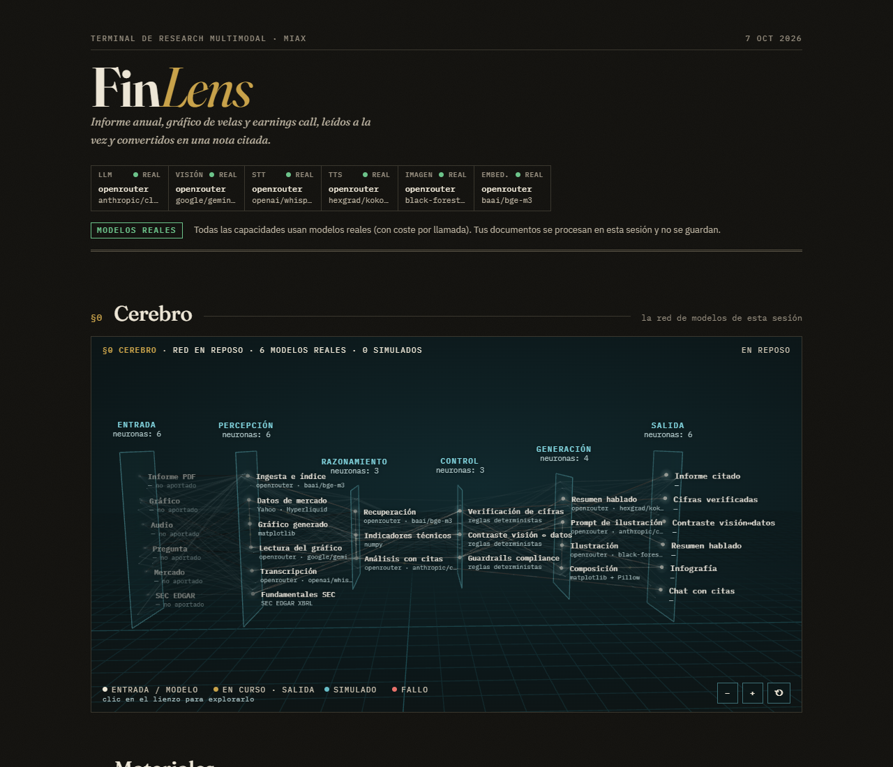
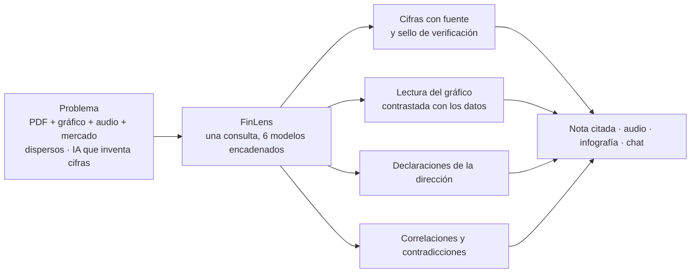
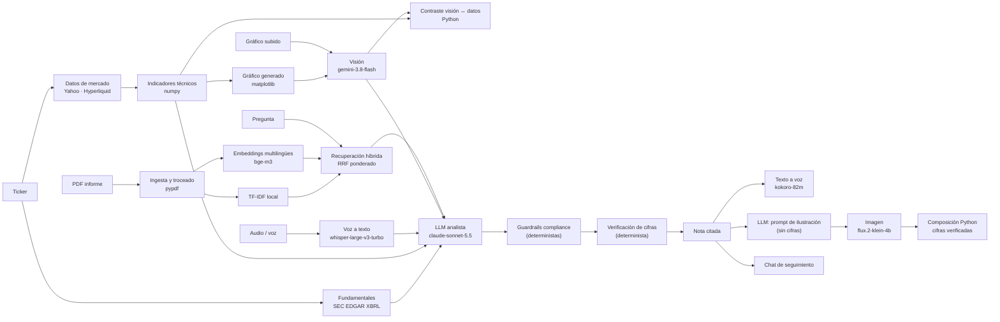
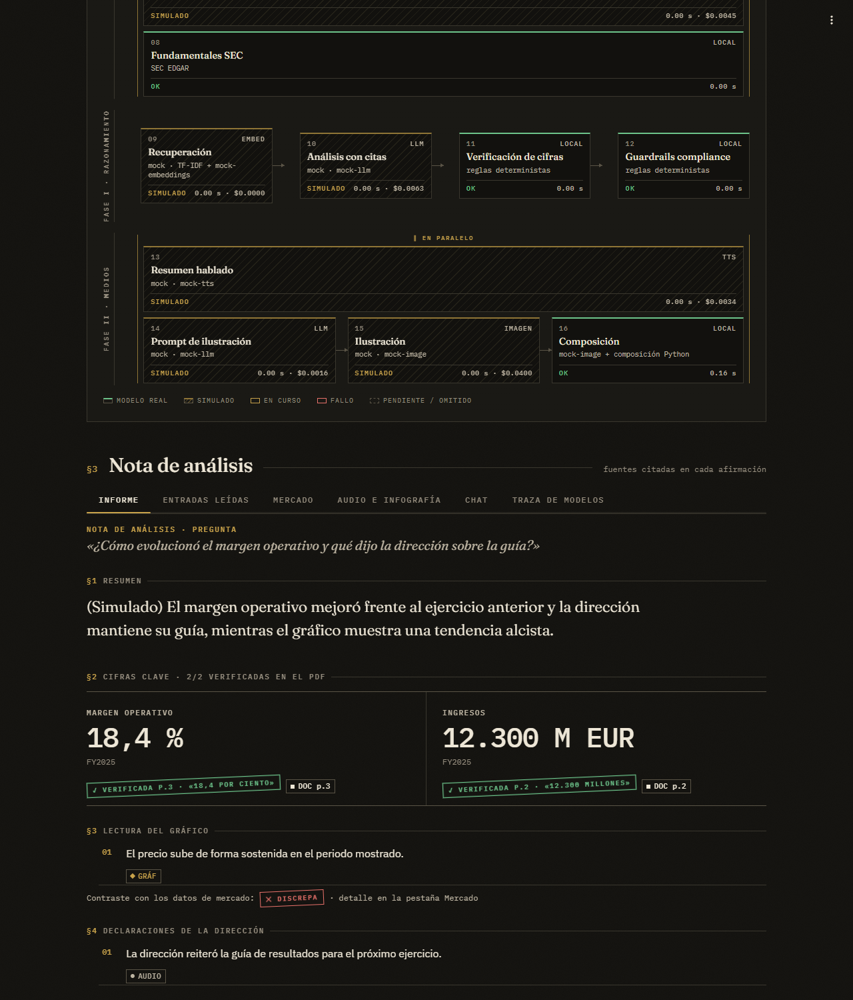
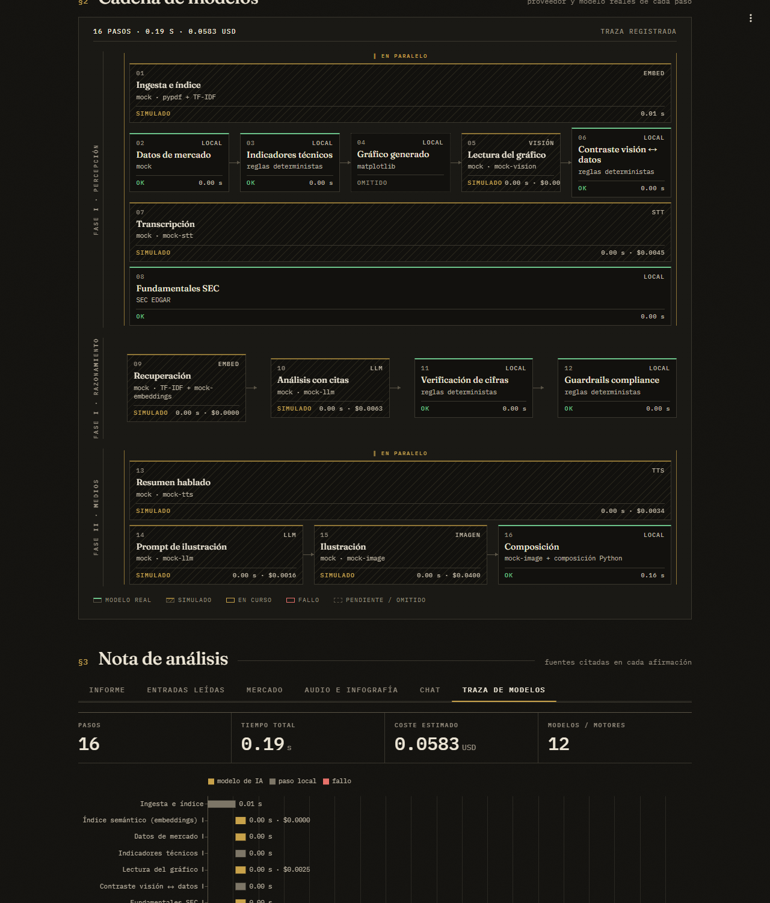
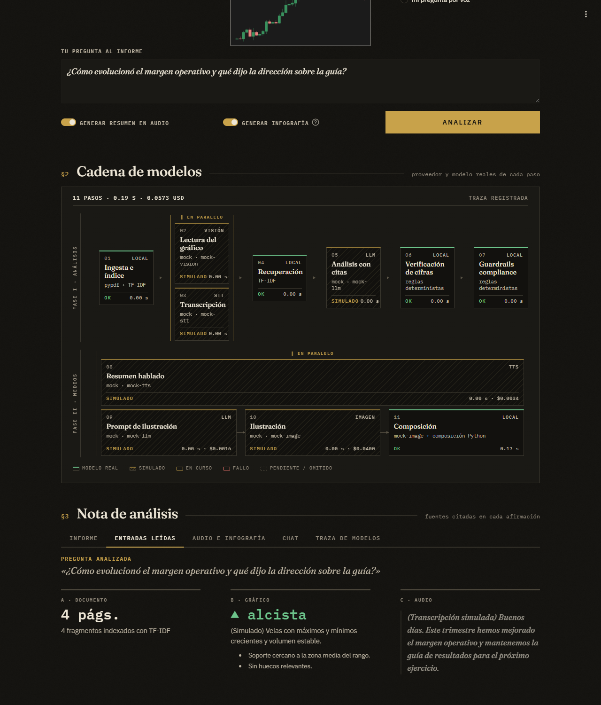
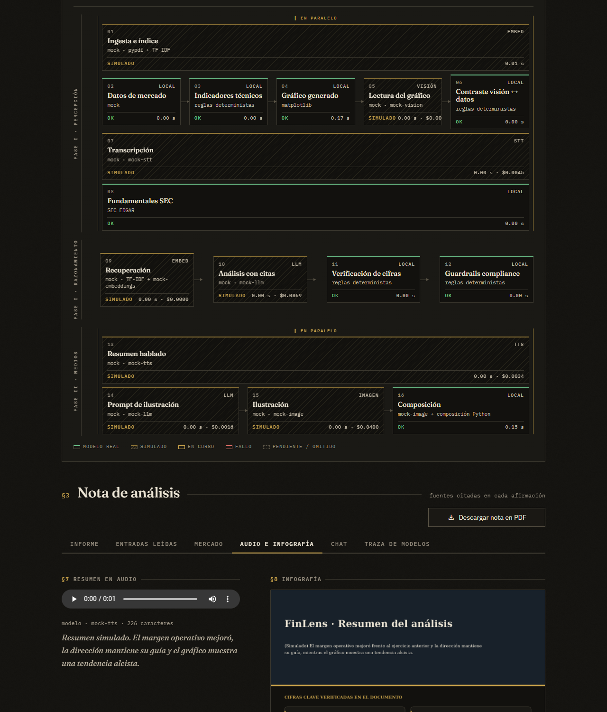

# FinLens – Research financiero multimodal con cifras verificadas

> Taller B5-T4 · Máster en IA y computación cuantitativa aplicada a mercados financieros (Instituto BME)
> Equipo: **Piettro Rodrigues, Alonso y Raúl Rodríguez** · Entrega: 8 de octubre de 2026
>
> *Startup ficticia creada como práctica de máster: el modelo de negocio es un ejercicio, no una oferta real.*

**Demo desplegada (AWS):** <https://108-128-114-211.sslip.io> (protegida con contraseña: cada análisis gasta
crédito real; pídela al equipo) · **Vídeo de la demo (3–5 min):** **[PENDIENTE: enlace]**



## 1. Problema y propuesta de valor

El analista financiero cruza a mano fuentes que viven en formatos distintos: el **informe anual en PDF**
(cientos de páginas, a menudo en inglés), el **gráfico de cotización**, el **audio de la conferencia de
resultados** y los **datos de mercado**. La parte valiosa —*¿lo que dice la dirección encaja con las cifras y
con lo que descuenta el mercado?*— se hace sin trazabilidad, y los asistentes de IA genéricos **inventan
cifras**.

**Público objetivo (B2B):** analistas junior y *sell-side*, EAFI y asesores independientes, gestoras boutique
y equipos de relación con inversores. Extensión B2B2C: módulo embebido en plataformas de brokers.

**Propuesta de valor:** una sola consulta cruza **texto, imagen, voz y datos de mercado** y devuelve una nota
de research donde **cada cifra lleva su fuente y un sello de verificación** calculado por código, no por el
LLM. Tres diferenciales:

1. **Cifras verificadas:** Python comprueba que cada número aparece en la página citada del PDF, en los
   fundamentales oficiales de la SEC o en los indicadores calculados («✓ VERIFICADA p.5 · «39,864»»).
2. **«La IA vio · los datos dicen»:** el modelo de visión lee el gráfico y Python contrasta cada nivel,
   soporte o tendencia que afirma con la serie real de precios (detector de alucinaciones visuales).
3. **Correlación y contradicciones entre modalidades:** informe ↔ gráfico ↔ dirección ↔ mercado.



## 2. Qué hace (demo en 30 segundos)

1. Aportas cualquier combinación de: informe anual (PDF), gráfico de cotización, audio de la conferencia o
   **tu pregunta por voz** (grabada en el navegador), y un **ticker** (`ITX.MC`, `AAPL`, `BTC`…).
2. Con ticker, FinLens **descarga los datos**: acciones de **Yahoo Finance**, cripto de **Hyperliquid**
   (velas, *funding* y *open interest* on-chain) y fundamentales oficiales de la **SEC EDGAR** (10-K).
3. Obtienes una **nota de análisis** con cifras citadas y verificadas, lectura del gráfico contrastada,
   declaraciones de la dirección, correlaciones y contradicciones, un **resumen en audio** y una
   **infografía** cuyas cifras dibuja Python.
4. Sigues preguntando en el **chat**, que reutiliza el índice del documento.
5. El **cerebro** (red neuronal 3D) y el **mapa de la cadena** muestran qué entra, qué modelo actúa, en qué
   orden y en paralelo, y qué sale; la **traza** da tiempo y coste por paso.

| Entradas (6) | Salidas (6) |
|---|---|
| PDF · imagen de gráfico · audio (conferencia) · voz (pregunta) · texto · ticker → datos de mercado y SEC | Nota citada y verificada · contraste visión↔datos · audio TTS · infografía · chat · traza de coste |

## 3. Arquitectura y flujo de datos multimodal



**Paralelismo real:** embeddings ‖ (mercado → técnicos → gráfico → visión → contraste) ‖ SEC ‖ STT, y luego
TTS ‖ infografía. La nota aparece en cuanto está lista; audio e infografía llegan después.

### Cadena de modelos (todos vía OpenRouter con una sola clave)

| Paso | Modelo por defecto | Por qué este | Alternativas probadas o configurables |
|---|---|---|---|
| Texto→texto (análisis, chat) | `anthropic/claude-sonnet-5.5` | Mejor seguimiento de JSON con citas; reconoce cuando un dato no consta en vez de inventarlo | `anthropic/claude-opus-5.5` (más caro), `google/gemini-3.8-flash` (más barato) |
| Imagen→texto (gráfico) | `google/gemini-3.8-flash` | Multimodal rápido (≈5 s) y barato (≈0,002 USD); proveedor distinto al LLM | `anthropic/claude-sonnet-5.5` |
| Voz→texto | `openai/whisper-large-v3-turbo` | Abierto, ≈0,0001 USD por audio de 80 s | `openai/whisper-large-v3` **devolvió transcripciones truncadas** en pruebas; `openai/gpt-4o-mini-transcribe` y `mistralai/voxtral-mini-transcribe` completas → el primero es el **respaldo automático** si se detecta truncado |
| Texto→voz | `hexgrad/kokoro-82m` | Modelo abierto de 82 M parámetros con voces en español; 0,0004 USD por resumen | `google/gemini-3.8-flash-tts`, `mistralai/voxtral-mini-tts-2603` |
| Texto→imagen | `black-forest-labs/flux.2-klein-4b` | Abierto y barato (0,015 USD); **solo ilustra**: las cifras las dibuja Python porque los modelos de difusión escriben mal los números | `bytedance-seed/seedream-4.5`, `openai/gpt-image-1-mini` |
| Embeddings | `baai/bge-m3` | Multilingüe y abierto: con la pregunta en español encuentra las páginas en inglés (1,8 s, 0,0002 USD para 78 fragmentos) | `qwen/qwen3-embedding-8b` (6,7 s y peor ranking en nuestra prueba); TF-IDF solo **falla** con pregunta en español y PDF en inglés |
| Datos de mercado | Yahoo Finance · Hyperliquid · SEC EDGAR | Públicos y sin clave; Hyperliquid aporta derivados on-chain (*funding*, OI) | En producción: proveedor con licencia (p. ej. BME Market Data) |

Más los pasos **deterministas en Python**: ingesta, TF-IDF, fusión RRF, indicadores técnicos, gráfico,
contraste visión↔datos, guardrails, verificación de cifras y composición de la infografía. Son el
antídoto contra las alucinaciones: los números que ve el usuario salen de datos o los comprueba el código.

Cada capacidad se elige por separado (`*_PROVIDER=auto|openrouter|anthropic|openai|mock`); también funciona
con claves nativas de Anthropic y OpenAI. Sin claves, **modo demo** completo con modelos simulados.

**Capas** (la separación la hace cumplir `tests/test_arquitectura.py`):

| Capa | Responsabilidad |
|---|---|
| `providers/` | Conexión con los modelos de IA. **Única** capa que importa los SDK. `Protocol`s en `base.py`, implementaciones OpenRouter/Anthropic/OpenAI y *mocks*. |
| `sources/` | Conectores de datos externos (Yahoo, Hyperliquid, SEC). Sin IA. |
| `domain/` | Lógica de negocio pura: ingesta, RAG híbrido, prompts, esquemas Pydantic, guardrails, verificación de cifras, técnicos, contraste, infografía, coste. |
| `orchestration/` | Encadenado, paralelismo, traza, degradación, caché LRU y métricas. |
| `ui/` + `app.py` | Interfaz Streamlit. Sin lógica de negocio. |

**Decisiones de diseño:** salidas del LLM como JSON validado con Pydantic y citas obligatorias (un reintento
con el motivo del fallo); degradación elegante (si falla un paso opcional se entrega el resto con aviso);
contenido de documentos tratado como datos, no instrucciones (*prompt injection*); detección de STT
truncado con reintento; razonamiento del LLM acotado (`OPENROUTER_REASONING_EFFORT`) para no cortar el JSON.

Más detalle en [`docs/arquitectura.md`](docs/arquitectura.md); especificaciones en
[`docs/05_SPEC_MEJORAS.md`](docs/05_SPEC_MEJORAS.md) y [`docs/06_SPEC_MERCADO_Y_CEREBRO.md`](docs/06_SPEC_MERCADO_Y_CEREBRO.md).

## 4. Instalación y ejecución (plug-and-play)

Requisitos: **Python 3.11+** (CI en 3.11 y 3.12) o Docker. Sin claves arranca en **modo demo**.

```bash
git clone https://github.com/piettro/Master-MIAX-Tarea-Bloque5-Multimodales.git finlens && cd finlens
cp .env.example .env        # opcional: pon OPENROUTER_API_KEY para usar modelos reales
./run.sh                    # Windows: run.bat
```

**Docker:**

```bash
docker build -t finlens .
docker run -p 8501:8501 --env-file .env finlens
```

**Despliegue en AWS** (EC2 + Caddy HTTPS, imagen en ECR, secretos en Secrets Manager, CI/CD con GitHub
Actions y OIDC, sin claves de AWS en GitHub): ver [`docs/DESPLIEGUE.md`](docs/DESPLIEGUE.md).

**Variables principales** (todas en [`.env.example`](.env.example)):

| Variable | Para qué |
|---|---|
| `OPENROUTER_API_KEY` | Una sola clave para las 6 capacidades de IA |
| `ANTHROPIC_API_KEY`, `OPENAI_API_KEY` | Alternativa: proveedores nativos |
| `*_PROVIDER` | `auto` (por defecto), `openrouter`, `anthropic`, `openai` o `mock`, por capacidad |
| `OPENROUTER_*_MODEL`, `OPENROUTER_TTS_VOICE`, `OPENROUTER_STT_FALLBACK_MODEL` | Modelos (slugs del catálogo de OpenRouter) |
| `OPENROUTER_REASONING_EFFORT`, `OPENROUTER_MIN_OUTPUT_TOKENS`, `STT_LANGUAGE` | Razonamiento, mínimo de tokens, idioma de transcripción |
| `SEC_USER_AGENT` | Contacto que exige la SEC para descargar fundamentales |
| `APP_PASSWORD` | Contraseña de la demo pública (vacía = acceso libre en local) |
| `DEMO_MODE`, `MAX_PDF_CHARS`, `LOG_LEVEL`, `PRICE_*` | Modo demo, límite de entrada, logs y tarifas de respaldo |

**Calidad:**

```bash
pip install -r requirements-dev.txt
pytest                                       # ~720 tests con mocks y datos grabados (cero coste, sin red)
ruff check . && mypy src                     # también en CI (GitHub Actions, 3.11 y 3.12)
FINLENS_LIVE_TESTS=1 pytest -m live -v -s    # humo contra las APIs reales (céntimos)
python scripts/medir.py -n 3 --salida docs/medidas.md   # coste y latencia reales
```

## 5. Viabilidad técnica y económica

Medido con APIs reales el **7-oct-2026** sobre los casos reales de `samples/` (informe anual 2025 de
Inditex, gráfico real de ITX.MC y audio): **6 ejecuciones, 0 fallos**. Informe completo en
[`docs/medidas.md`](docs/medidas.md). El coste es **99 % real** (lo informa OpenRouter en cada respuesta,
`usage.cost`), no una estimación.

| Componente | Uso medio | Coste medio (USD) |
|---|---|---|
| LLM (análisis + prompt de ilustración) | 8.849 tokens entrada / 3.092 salida | 0,0446 |
| Voz a texto | 0,7 min | 0,0001 |
| Texto a voz | 710 caracteres | 0,0004 |
| Imagen | 1 ilustración | 0,0150 |
| Embeddings | 21.395 tokens | 0,0002 |
| **Total por análisis completo** | | **0,060** |

Un análisis **solo con ticker** (sin PDF ni medios) cuesta **≈0,027 USD** y tarda ≈17–20 s (medido con
AAPL y BTC: 11/11 cifras verificadas en ambos).

| Latencia | Media | Máx. |
|---|---|---|
| Nota en pantalla (ingesta → verificación) | **21,9 s** | 24,9 s |
| Todo, con audio e infografía | **31,4 s** | 35,7 s |
| Análisis LLM | 13,9 s | 16,8 s |
| Lectura del gráfico | 4,8 s | 5,5 s |
| Transcripción (80 s de audio) | 3,7 s | 7,0 s |

**Lectura:** la UX no es tiempo real, pero sí fluida para el caso de uso (un analista tarda horas en esta
tarea). El mapa vivo y el render progresivo hacen la espera legible. Para bajar latencia: modelo más rápido
para el análisis (`gemini-3.8-flash`), *streaming* de la respuesta y caché del índice por documento.

**Palancas de coste:** recuperación (no se envía el PDF entero), límite de entrada, caché por *hash*, omitir
audio o infografía, esfuerzo de razonamiento acotado y modelos abiertos baratos en TTS, imagen y embeddings.

**Infraestructura de la demo:** EC2 t3.micro + IPv4 + disco ≈ **12 USD/mes** (dentro del presupuesto de
14 USD/mes de la cuenta AWS del máster).

## 6. Compliance y privacidad

- **MiFID II / CNMV — informa, no asesora:** guardrail determinista (`domain/guardrails.py`) que detecta
  recomendaciones en español e inglés (imperativo, condicional, *rating*, precio objetivo de un valor…) en la
  nota, el chat, el guion de audio y el prompt de imagen; **retira solo la frase infractora**, avisa y añade
  un aviso legal a cada salida (también hablado). Normaliza caracteres invisibles para que no se pueda
  esquivar. Es una heurística conservadora; no sustituye la revisión legal.
- **Anti-alucinación:** citas obligatorias + verificación determinista de cifras y del gráfico.
- **RGPD:** no se almacenan documentos; la caché vive en memoria de la sesión. En modo real los datos van a
  los proveedores de IA (se avisa en la interfaz). En producción: DPA y proveedores con residencia en la UE.
- **AI Act:** transparencia: todo se marca como generado por IA y cada afirmación cita su fuente.
- **Seguridad de la demo:** contraseña, secretos en AWS Secrets Manager, OIDC entre GitHub y AWS, IMDSv2,
  sin SSH, HTTPS. Riesgo conocido de la industria: clonación de voz (no usamos clonación).
- **Datos de mercado:** Yahoo Finance es una API no oficial (uso académico); en producción, proveedor con licencia.

*(No es asesoramiento legal.)*

## 7. Monetización

SaaS B2B por volumen de análisis. Coste variable medido: **0,060 USD por análisis completo** (≈0,055 €).
Precios **hipotéticos** (práctica de máster) con margen bruto sobre el coste de IA:

| Plan | Para quién | Incluye | Precio | Coste IA máx. | Margen bruto |
|---|---|---|---|---|---|
| **Free** | Probar | 5 análisis/mes, solo nota, marca de agua | 0 € | 0,28 € | captación |
| **Pro** | Analista individual | 150 análisis/mes, audio, infografía, chat, mercado | **49 €/mes** | 8,3 € | **≈83 %** |
| **Team** | Gestoras, EAFI (5 usuarios) | 1.000 análisis/mes, espacio compartido | **390 €/mes** | 55 € | **≈86 %** |
| **API** | Brokers (B2B2C) | Pago por uso, integración | **0,25 €/análisis** | 0,055 € | **≈78 %** |

El margen real será menor (infraestructura, soporte, datos de mercado con licencia), pero el coste de IA no
es la restricción: un plan Pro cubre el coste de IA con solo 9 análisis.

## 8. Pitch técnico

**Problema** → el analista cruza a mano PDF, gráfico, audio y mercado, y la IA genérica inventa cifras.
**Solución** → una consulta, 6 modelos especializados encadenados y verificación determinista de cada cifra.
**Por qué multimodal** → ningún modelo único recupera la página exacta, lee el gráfico, transcribe la
llamada, trae los datos y los contrasta. **Arquitectura** → capas separadas, proveedores intercambiables por
capacidad, modo demo, degradación elegante, compliance por diseño, CI/CD a AWS. **Viabilidad** → 0,06 USD y
31 s por análisis medidos. Diapositivas: [`docs/pitch.md`](docs/pitch.md).

## 9. Capturas

| Nota de análisis | Traza de modelos |
|---|---|
|  |  |

| Entradas leídas | Audio e infografía |
|---|---|
|  |  |

## 10. Limitaciones y hoja de ruta

- El **guardrail** es heurístico: puede dejar pasar formulaciones muy indirectas («yo me saldría del valor»).
- La **verificación de cifras** comprueba que el número está en la fuente citada, no que su interpretación
  sea correcta.
- Sin **OCR**: un PDF escaneado no se puede analizar.
- Los **audios de la demo son sintéticos** (lectura de extractos del propio informe): los de earnings calls
  reales tienen derechos de autor.
- Precisión del análisis **no evaluada sistemáticamente** (sería el siguiente paso: conjunto de preguntas con
  respuesta conocida).
- **Hoja de ruta:** vídeo-análisis de webinars, OCR, *streaming*, comparación entre empresas, alertas por
  ticker, multiusuario con autenticación real y evaluación continua.

## 11. Estructura del repositorio

```
├── app.py                      # entrada de Streamlit (solo UI)
├── requirements*.txt · pyproject.toml · Dockerfile · run.sh · run.bat · .env.example
├── src/finlens/
│   ├── config.py               # ajustes por variables de entorno
│   ├── providers/              # Protocols + OpenRouter, Anthropic, OpenAI, mocks, registro por capacidad
│   ├── sources/                # Yahoo Finance, Hyperliquid, SEC EDGAR (+ mock)
│   ├── domain/                 # ingesta, RAG híbrido, prompts, esquemas, guardrails, verificación de cifras,
│   │                           # técnicos, gráfico, contraste visión↔datos, infografía, coste
│   ├── orchestration/          # pipeline paralelo, traza, caché LRU, métricas
│   └── ui/                     # tema editorial, mapa de la cadena, cerebro 3D (Three.js), Gantt, vistas
├── scripts/                    # medir.py, capturas.py, preparar_casos.py
├── samples/                    # casos reales (Inditex) y entradas inválidas
├── deploy/                     # CloudFormation (AWS) y script de despliegue
├── .github/workflows/          # CI (ruff, mypy, pytest) y despliegue a AWS
├── tests/                      # ~720 tests (mocks y respuestas reales grabadas)
└── docs/                       # arquitectura, specs, medidas, despliegue, pitch, enunciado
```

## Aviso legal

Información generada con IA con fines informativos. No constituye asesoramiento en materia de inversión.
