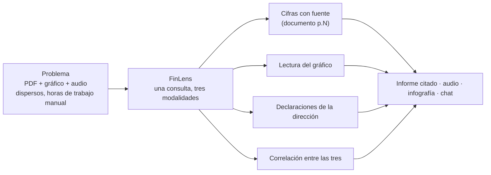
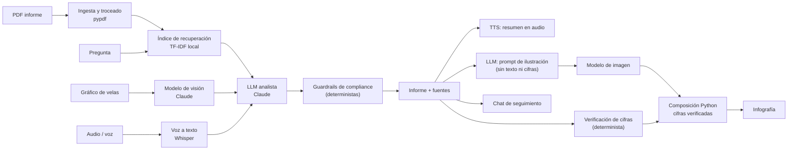

# FinLens – Análisis multimodal de informes financieros

> Taller B5-T4 · Máster en IA y computación cuantitativa aplicada a mercados financieros (Instituto BME)
> Equipo: **[PENDIENTE: Nombre 1, Nombre 2, Nombre 3]** · Entrega: 8 de octubre de 2026

**Demo desplegada:** **[PENDIENTE: enlace]** · **Vídeo de la demo (3–5 min):** **[PENDIENTE: enlace]**


> **Nota sobre las capturas:** están hechas en **modo demo** (respuestas simuladas, marcadas como «(Simulado)»).
> Muestran la interfaz y el flujo reales, pero no la calidad del análisis. Las cifras de coste y latencia de
> la sección 5 **no se han rellenado con datos simulados**: se generan con `scripts/medir.py` y claves reales.

## 1. Problema y propuesta de valor

El analista financiero dedica horas a cruzar fuentes que viven en formatos distintos y que nada conecta:
el **informe anual en PDF** (cientos de páginas), el **gráfico de cotización** y el **audio de la conferencia
de resultados**. Leer el PDF, interpretar el gráfico y escuchar la llamada son tres tareas separadas, y la
parte valiosa —*¿lo que dijo la dirección encaja con las cifras y con lo que descuenta el mercado?*— se hace
a mano y sin trazabilidad.

**Público objetivo (B2B):** analistas junior y *sell-side*, EAFI y asesores independientes, gestoras boutique
y equipos de relación con inversores. Extensión B2B2C: módulo embebido en plataformas de brokers.

**Propuesta de valor multimodal:** una sola consulta cruza **texto, imagen y voz** y devuelve cifras **con su
fuente** (`documento p.3`), la lectura del gráfico y las declaraciones de la dirección, y señala dónde
coinciden o se contradicen. El valor diferencial es la **correlación entre modalidades**, no el chat: un único
modelo conversacional no recupera, por sí solo, la página exacta del informe, no lee el gráfico con visión
y no transcribe la llamada; aquí cada paso lo resuelve un modelo especializado y el orquestador los encadena.



## 2. Qué hace (demo en 30 segundos)

1. Subes un informe anual (PDF), el gráfico de cotización y el audio de la conferencia (o tu pregunta por voz).
2. Escribes una pregunta, o la dices por voz, o la dejas vacía para un resumen general.
3. Obtienes un informe con cifras **citadas**, la lectura del gráfico, un resumen en **audio** y una **infografía**.
4. Sigues preguntando en el **chat**, con el contexto del informe y del documento.
5. La pestaña **Traza de modelos** enseña qué modelo hizo cada paso, cuánto tardó y cuánto costó.

| Entradas | Salidas |
|---|---|
| PDF · imagen de gráfico · audio (conferencia o pregunta por voz) · texto | Informe estructurado con fuentes · audio TTS · infografía · chat de seguimiento |

## 3. Arquitectura y flujo de datos multimodal



La **visión y la transcripción se ejecutan en paralelo**, y también el audio y la infografía. El informe
aparece en pantalla en cuanto está listo; el audio y la infografía llegan después (render progresivo).

Cada capacidad se asigna a un proveedor de forma independiente (`*_PROVIDER`). Con una sola clave de
**OpenRouter** funcionan las cinco; también se pueden usar Anthropic (LLM/visión) y OpenAI (voz/imagen).

| Modalidad | Modelo por defecto (OpenRouter) | Rol |
|---|---|---|
| Texto→texto | `anthropic/claude-sonnet-5.5` | Análisis, síntesis y chat |
| Imagen→texto | `google/gemini-3.8-flash` | Lectura del gráfico |
| Voz→texto | `openai/whisper-large-v3-turbo` | Transcripción |
| Texto→voz | `hexgrad/kokoro-82m` (voz `ef_dora`) | Resumen en audio |
| Texto→imagen | `black-forest-labs/flux.2-klein-4b` | Ilustración de fondo de la infografía (sin cifras: las compone Python) |
| Recuperación | TF-IDF (scikit-learn) | Local, coste 0 | Selección de fragmentos del PDF |

> Los nombres de modelo y las tarifas son **configurables por variable de entorno** (`.env`) y **deben
> verificarse en la documentación oficial** de cada proveedor: los catálogos cambian y se retiran modelos.
> Hay un test opcional que comprueba que cada modelo configurado existe (ver sección 4).

**Capas** (la separación la hace cumplir un test, `tests/test_arquitectura.py`):

| Capa | Responsabilidad |
|---|---|
| `providers/` | Conexión con los modelos. **Única** capa que importa los SDK de `anthropic` y `openai`. Define los `Protocol` (`base.py`), las implementaciones reales y los *mocks*. |
| `domain/` | Lógica de negocio: ingesta, RAG, prompts, esquemas Pydantic, guardrails, coste. Solo conoce los `Protocol`. |
| `orchestration/` | Encadenado de pasos, paralelismo, traza, degradación, caché y métricas. |
| `ui/` + `app.py` | Interfaz Streamlit. Sin lógica de negocio. |

**Decisiones de diseño**

- **Modo demo con *mocks***: si faltan claves o `DEMO_MODE=true`, la app arranca y recorre todo el flujo con
  respuestas simuladas. Los tests usan solo *mocks*: cero coste.
- **Salidas del LLM = JSON validado con Pydantic** y con citas obligatorias. Si el JSON es inválido se
  reintenta una vez y, si vuelve a fallar, se degrada con un mensaje claro.
- **Degradación elegante**: si falla un paso opcional (visión, STT, TTS, imagen) se entrega el informe con
  un aviso. Solo la ingesta del PDF y el análisis son obligatorios.
- **Guardrail determinista de compliance** (ver sección 6) y *disclaimer* en todas las salidas.
- **Seguridad frente a *prompt injection***: los prompts tratan el contenido del PDF y de la transcripción como
  datos, no como instrucciones.
- **Palancas de coste**: recuperación TF-IDF en lugar de enviar el PDF entero, límite de texto ingerido,
  caché por *hash* de los archivos, casillas para omitir audio e infografía, y límite de subida de 30 MB.

Más detalle y diagramas de secuencia en [`docs/arquitectura.md`](docs/arquitectura.md).

## 4. Instalación y ejecución (plug-and-play)

Requisitos: **Python 3.11+** (probado en 3.11 y 3.12) o Docker. Sin claves arranca en **modo demo**.

```bash
git clone <url-del-repo> && cd finlens
cp .env.example .env        # opcional: sin claves arranca en modo demo
./run.sh                    # Windows: run.bat   (si no es ejecutable: bash run.sh)
```

`run.sh` / `run.bat` crean el entorno virtual, instalan las dependencias y lanzan la app en
<http://localhost:8501>. **La primera vez tarda unos minutos** (se descargan Streamlit, scikit-learn y los SDK;
en las pruebas, entre 1 y 4 minutos según la red); las siguientes arrancan en segundos.

**Docker**

```bash
docker build -t finlens .
docker run -p 8501:8501 --env-file .env finlens      # sin .env: docker run -p 8501:8501 finlens
```

**Modo real:** copia `.env.example` a `.env` y rellena `OPENROUTER_API_KEY` (cubre las cinco capacidades) o,
alternativamente, `ANTHROPIC_API_KEY` y/o `OPENAI_API_KEY`. La elección es **por capacidad**: en `auto` se usa
OpenRouter si hay clave, si no el proveedor nativo y si no el simulado. Las capacidades sin clave quedan en
modo demo y la app lo indica; con `DEMO_MODE=true` todo es simulado.

| Variable | Para qué |
|---|---|
| `DEMO_MODE` | `true` fuerza el modo demo |
| `OPENROUTER_API_KEY`, `ANTHROPIC_API_KEY`, `OPENAI_API_KEY` | Claves de los proveedores |
| `LLM_PROVIDER`, `VISION_PROVIDER`, `STT_PROVIDER`, `TTS_PROVIDER`, `IMAGE_PROVIDER`, `EMBEDDINGS_PROVIDER` | `auto` (por defecto), `openrouter`, `anthropic`, `openai` o `mock` |
| `OPENROUTER_LLM_MODEL`, `OPENROUTER_VISION_MODEL`, `OPENROUTER_STT_MODEL`, `OPENROUTER_TTS_MODEL`, `OPENROUTER_TTS_VOICE`, `OPENROUTER_IMAGE_MODEL`, `OPENROUTER_EMBEDDINGS_MODEL`, `OPENROUTER_STT_FALLBACK_MODEL` | Modelos de OpenRouter (slugs de su catálogo); embeddings `baai/bge-m3` para preguntar en español sobre informes en inglés |
| `OPENROUTER_REASONING_EFFORT`, `OPENROUTER_MIN_OUTPUT_TOKENS`, `STT_LANGUAGE` | Esfuerzo de razonamiento y mínimo de `max_tokens` en OpenRouter; idioma de la transcripción (vacío = autodetección) |
| `LLM_MODEL`, `VISION_MODEL`, `STT_MODEL`, `TTS_MODEL`, `TTS_VOICE`, `IMAGE_MODEL` | Modelos (verificar en la documentación oficial) |
| `LLM_EFFORT` | Profundidad de razonamiento del LLM (`low`…`max`; vacío = no enviarlo) |
| `LLM_MIN_OUTPUT_TOKENS` | Mínimo de `max_tokens` solo para Anthropic nativo (el pensamiento comparte presupuesto con la respuesta) |
| `LOG_LEVEL` | Nivel del logger `finlens` (nunca registra documentos ni claves) |
| `LLM_REFUSAL_FALLBACK` | `true` = reintento en otro modelo si Anthropic rechaza la petición (API beta) |
| `IMAGE_SIZE`, `IMAGE_QUALITY` | Tamaño y calidad de la imagen (solo OpenAI nativo) |
| `MAX_PDF_CHARS` | Límite de texto ingerido del PDF |
| `PRICE_*` | Tarifas para estimar el coste (verificar en las páginas oficiales) |

**Tests**

```bash
pip install -r requirements-dev.txt
pytest                                       # todos con mocks (cero coste)
ruff check . && mypy src                     # calidad (también en CI)
FINLENS_LIVE_TESTS=1 pytest -m live -v -s    # opcional: humo contra las APIs reales (consume crédito)
```

Los tests en vivo comprueban primero, **gratis**, que los modelos configurados existen (catálogo público de OpenRouter o API de modelos del proveedor nativo); después hacen una
llamada mínima por modalidad e imprimen latencia y consumo.

## 5. Viabilidad técnica y económica

**Coste por análisis** = tokens de entrada × tarifa + tokens de salida × tarifa + minutos de audio × tarifa
STT + caracteres × tarifa TTS + 1 imagen. Lo calcula `domain/cost.py` y se ve **por paso en la UI**.

Medición con las APIs reales sobre los casos de `samples/` (la tabla se genera sola):

```bash
python scripts/medir.py -n 3 --salida docs/medidas.md
```

| Componente | Uso medio | Coste (USD) |
|---|---|---|
| LLM (tokens ent./sal.) | **[PENDIENTE: medir]** | **[PENDIENTE]** |
| STT | **[PENDIENTE]** min | **[PENDIENTE]** |
| TTS | **[PENDIENTE]** caracteres | **[PENDIENTE]** |
| Imagen | 1 | **[PENDIENTE]** |
| **Total** | | **[PENDIENTE]** |

**Latencias medidas:** ingesta **[PENDIENTE]** s · visión **[PENDIENTE]** s · STT **[PENDIENTE]** s · análisis
**[PENDIENTE]** s · TTS **[PENDIENTE]** s · imagen **[PENDIENTE]** s · informe en pantalla **[PENDIENTE]** s ·
total **[PENDIENTE]** s. Visión y STT corren en paralelo, y también TTS e infografía, por lo que el informe
llega antes que los medios.

> **Tarifas de referencia usadas por el código** (editables, USD, **a verificar** en las páginas oficiales antes
> de citarlas): LLM 2 / 10 por millón de tokens (entrada / salida), STT 0,006 por minuto, TTS 15 por millón de
> caracteres y 0,04 por imagen. Con modelos que razonan, los tokens de pensamiento se facturan como salida, así
> que el coste real puede quedar por encima de una estimación ingenua: de ahí la importancia de medir.

**Palancas de coste:** recuperación TF-IDF en lugar del PDF completo, límite de texto ingerido
(`MAX_PDF_CHARS`), caché por *hash*, omitir audio o infografía con las casillas de la UI, `LLM_EFFORT` para
ajustar la profundidad de razonamiento y modelos pequeños para tareas simples.

## 6. Compliance y privacidad

- **MiFID II / CNMV:** la herramienta **informa, no asesora**. Un **guardrail determinista**
  (`domain/guardrails.py`) detecta lenguaje de recomendación (compra, venta, ponderación, precio objetivo) en el
  informe, el chat, el guion de audio y el prompt de la infografía; retira lo infractor, avisa en pantalla y
  añade un *disclaimer* a cada salida (también hablado en el audio). Es una **heurística por expresiones
  regulares**, conservadora pero no exhaustiva (ver limitaciones); no sustituye la revisión legal.
- **RGPD:** el MVP no almacena documentos; el procesamiento es por sesión y la caché vive solo en memoria. En
  modo real los datos se envían a los proveedores de IA (se avisa en la interfaz). En producción: DPA con cada
  proveedor y proveedores con residencia en la UE.
- **AI Act (UE):** transparencia: el contenido se indica como generado por IA y cada afirmación cita su fuente.
- **Datos bancarios (PSD2):** fuera del MVP; sería requisito si se conectaran cuentas.

*(No es asesoramiento legal; contrastar con el temario del máster.)*

## 7. Monetización

Modelo **SaaS B2B por volumen de análisis**. Los precios son **hipótesis de partida a validar con clientes**,
no resultados.

| Plan | Para quién | Incluye | Precio (hipótesis) |
|---|---|---|---|
| **Free** | Probar el producto | Pocos análisis al mes, solo informe, marca de agua | 0 |
| **Pro** | Analista individual | Análisis ampliados + audio + infografía + chat | **[PENDIENTE: precio por analista y mes]** |
| **Team / API** | Gestoras, EAFI, brokers | Integración con flujos internos, facturación por uso | **[PENDIENTE: cuota + uso]** |

**Margen** = precio − (coste medio por análisis × análisis incluidos). El número máximo de análisis que
soporta un plan con margen positivo es `precio / coste medio`; el **coste medio** sale de la sección 5.

## 8. Pitch técnico

**Problema** → el analista cruza a mano PDF, gráfico y audio. **Solución** → una consulta que los cruza y
devuelve cifras citadas. **Por qué multimodal** → ningún modelo único cubre recuperación, visión, voz y
generación; el valor está en orquestarlos y en la trazabilidad. **Arquitectura** → capas separadas, modelos
intercambiables, modo demo, degradación elegante, compliance por diseño. **Tracción potencial** → equipos de
research de boutiques y EAFI. **Hoja de ruta** → ver sección 10.

Versión en diapositivas: [`docs/pitch.md`](docs/pitch.md).

## 9. Capturas

| Informe | Traza de modelos |
|---|---|
|  |  |

| Entradas leídas | Audio e infografía |
|---|---|
|  |  |

*(Capturas en modo demo; la infografía simulada es un lienzo liso. **[PENDIENTE: repetirlas con claves reales
con `python scripts/capturas.py`]**.)*

## 10. Limitaciones y hoja de ruta

**Limitaciones conocidas**

- El **guardrail** es una heurística: no detecta, por ejemplo, «vendería antes de resultados», «potencial de
  revalorización del 30 %» ni «yo me saldría del valor». Los falsos positivos se prefieren a los negativos.
- La **precisión del análisis** (lectura del gráfico, extracción de cifras) depende del modelo y no está
  evaluada de forma sistemática.
- Con modelos de transcripción sin duración, la **duración del audio** (y su coste) se estima por tamaño,
  salvo en WAV.
- Un PDF **escaneado** (sin texto) no se puede analizar: no hay OCR en el MVP.
- La **caché** y el historial del chat viven solo en la sesión.

**Hoja de ruta (fuera del alcance del MVP):** vídeo-análisis de webinars, búsqueda multimodal con CLIP,
conexión a datos de mercado en tiempo real, multiusuario y autenticación, OCR, evaluación sistemática de
precisión y *embeddings* en lugar de TF-IDF.

## 11. Estructura del repositorio

```
finlens/
├── app.py                      # entrada de Streamlit (solo UI)
├── requirements.txt · requirements-dev.txt · pyproject.toml
├── Dockerfile · .dockerignore · run.sh · run.bat · .env.example
├── .streamlit/config.toml      # límite de subida, sin telemetría
├── src/finlens/
│   ├── config.py               # ajustes por variables de entorno
│   ├── providers/              # base.py (Protocols), anthropic_provider, openai_provider, openrouter_provider, mock, registry, media
│   ├── domain/                 # schemas, prompts, ingest, rag, guardrails, grounding, infographic, cost, structured
│   ├── orchestration/          # pipeline, trace, cache, metrics
│   └── ui/                     # views (Streamlit), demo_samples
├── scripts/                    # medir.py (latencia y coste), capturas.py (capturas del README)
├── samples/                    # casos de prueba (demo ficticio, entradas inválidas) y README
├── tests/                      # ~200 tests con mocks, guardrails, ingesta, pipeline, UI, arquitectura
└── docs/                       # arquitectura, pitch, enunciado, plan y capturas (docs/img)
```

## Aviso legal

Información generada con IA con fines informativos. No constituye asesoramiento en materia de inversión.
