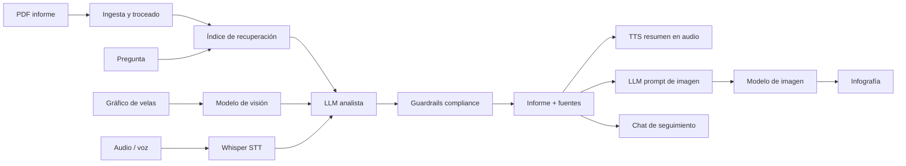

# Especificación del producto – FinLens (nombre provisional)

> Documento de contexto para dar a Claude / Claude Code. Fuente de verdad del alcance del MVP.

## 1. Idea en una frase
**FinLens** convierte, en minutos, los materiales dispersos de una empresa cotizada (informe anual en PDF, gráfico de cotización y audio de la conferencia de resultados) en un análisis estructurado y citado, un resumen en audio y una infografía.

## 2. Problema y público
- **Problema:** el analista dedica horas a cruzar el PDF del informe, mirar gráficos y escuchar la conferencia de resultados. La información está en formatos distintos y nada la conecta.
- **Público (B2B):** analistas junior/sell-side, EAFI y asesores independientes, gestoras boutique, equipos de relación con inversores. Extensión B2B2C: embebido en plataformas de brokers.
- **Propuesta de valor multimodal:** una sola consulta cruza texto, imagen y voz, y devuelve cifras **con fuente**, lectura del gráfico y las declaraciones de la dirección. El valor diferencial es la **correlación entre modalidades**, no el chat.

## 3. Alcance del MVP
**Entradas:** PDF (informe) · imagen (gráfico de velas) · audio (conferencia o pregunta por voz) · texto (pregunta).
**Salidas:** informe estructurado con fuentes · resumen en audio (TTS) · infografía (modelo de imagen) · chat de seguimiento con contexto.
**Fuera de alcance:** vídeo, CLIP/búsqueda multimodal, datos bancarios, login, multiusuario (hoja de ruta).

## 4. Flujo de datos multimodal

Visión y STT se ejecutan **en paralelo**. Cada paso registra modelo, tiempo y coste en una traza visible en la UI.

## 5. Modelos (capa de IA intercambiable)
| Modalidad | Función | Opción por defecto | Alternativa |
|---|---|---|---|
| Texto→texto | Razonamiento y síntesis | Claude (Anthropic API) | GPT, Gemini, Ollama |
| Imagen→texto | Lectura de gráfico | Mismo modelo multimodal | Gemini |
| Voz→texto | Transcripción | Whisper (OpenAI API) | faster-whisper local |
| Texto→voz | Resumen en audio | OpenAI TTS | ElevenLabs |
| Texto→imagen | Infografía | OpenAI imagen | Stable Diffusion |
| Recuperación | RAG sobre el PDF | TF-IDF local (coste 0) | Embeddings |

Los nombres exactos de modelo van en `.env` y deben verificarse en la documentación de cada proveedor.

## 6. Arquitectura y estructura del repo
Separación estricta: **providers** (conexión con modelos) · **domain** (lógica de negocio) · **orchestration** · **ui**.
```
finlens/
├── app.py                     # entrada Streamlit (solo UI)
├── requirements.txt · Dockerfile · run.sh · run.bat · .env.example
├── README.md
├── docs/                      # arquitectura, pitch, capturas, diagrama
├── samples/                   # PDF, gráfico y audio de prueba
├── src/finlens/
│   ├── config.py              # settings por variables de entorno
│   ├── providers/             # base.py (Protocols), anthropic, openai, mock, registry
│   ├── domain/                # schemas, prompts, ingest, rag, guardrails, cost
│   ├── orchestration/         # pipeline.py (encadenado, paralelismo, traza)
│   └── ui/                    # componentes Streamlit
└── tests/                     # pipeline con mocks, guardrails, ingesta
```
**Principios:** (1) la lógica de negocio solo conoce interfaces (`Protocol`), nunca un SDK; (2) **modo demo** con mocks si faltan claves, para que la app siempre arranque; (3) salidas estructuradas (Pydantic) con fuentes citadas; (4) errores controlados por paso, degradación elegante (si falla TTS, se entrega el informe igualmente).

## 7. Viabilidad técnica y económica (rellenar con datos medidos)
- **Coste por análisis** = tokens de entrada×tarifa + tokens de salida×tarifa + minutos de audio×tarifa STT + caracteres×tarifa TTS + 1 imagen. Medirlo con el módulo `cost.py` sobre los 3 casos de prueba y reportar la media. Las tarifas del código son orientativas: **verificar en las páginas oficiales antes de citarlas**.
- **Latencia:** medir por paso (ingesta, visión, STT, análisis, TTS, imagen) y total. Objetivo orientativo: informe en pantalla en pocos segundos y TTS/infografía cargando después (render progresivo).
- **Palancas de coste:** troceado + recuperación (no enviar el PDF entero), caché por hash de archivo, modelo pequeño para tareas simples, límite de longitud de entrada.

## 8. Compliance y privacidad
- **MiFID II / CNMV:** la herramienta **informa**, no personaliza recomendaciones. Guardrail determinista que detecta lenguaje de compra/venta o precio objetivo, más disclaimer en todas las salidas.
- **RGPD:** el MVP no almacena documentos del usuario; el procesamiento es por sesión; aviso de que los datos se envían a proveedores de IA; recomendación de DPA y proveedores con residencia UE para producción.
- **AI Act (UE):** transparencia: indicar que el contenido es generado por IA y citar fuentes.
- **Datos bancarios (PSD2):** fuera del MVP; mencionar como requisito si se conectan cuentas.
*(No es asesoramiento legal; contrastar con el temario del máster.)*

## 9. Monetización (propuesta)
SaaS B2B por volumen: **Free** (pocos análisis/mes, marca de agua), **Pro** (por analista, análisis ampliados + audio + infografía), **Team/API** (integración con flujos internos, facturación por uso). Margen = precio − coste medio por análisis (sección 7).

## 10. Casos de prueba para la demo
1. Informe anual real de una cotizada + gráfico de su cotización + extracto de su earnings call (audio).
2. Pregunta por voz: “¿Cómo evolucionó el margen operativo y qué dijo la dirección sobre la guía?”
3. Entrada inválida (PDF sin texto, audio vacío) para mostrar robustez.
Usar material público y respetar licencias; no incluir datos personales.

## 11. Criterios de “hecho”
App arranca en modo demo con un comando · flujo completo con APIs reales · traza de modelos visible · tests en verde · README con capturas y diagrama · demo grabada · sin claves en el repo.
