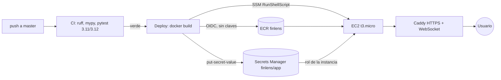

# Despliegue de la demo en AWS

Arquitectura: **GitHub Actions → ECR → EC2 (Docker + Caddy)**, región `eu-west-1`.

Decisiones:

| Decisión | Motivo |
|---|---|
| EC2 + Caddy, no App Runner | App Runner no admite WebSocket y Streamlit lo necesita |
| EC2, no ECS Fargate + ALB | El ALB solo cuesta ~16 USD/mes; el presupuesto del máster es 14 USD/mes |
| OIDC entre GitHub y AWS | No hay claves de AWS de larga duración en GitHub; el rol solo confía en el environment `produccion` de este repo, limitado a `master` |
| Despliegue solo tras push a master del propio repo | `workflow_run` tiene secretos: un PR desde un fork nunca despliega |
| IMDSv2 con hop limit 1 | Los contenedores no pueden leer las credenciales del rol de la instancia |
| Actions fijadas por SHA | Evita que un tag movido inyecte código en un job con secretos |
| SSM en vez de SSH | Sin puerto 22 abierto ni claves SSH |
| Secretos en Secrets Manager | La clave de OpenRouter nunca está en la imagen ni en el repo; la instancia la lee con su rol |
| `APP_PASSWORD` | La demo es pública y cada análisis gasta crédito real |
| `<ip>.sslip.io` | HTTPS con Let's Encrypt sin comprar dominio |

Coste estimado: t3.micro (~7,6 USD) + IPv4 pública (~3,6 USD) + 12 GB gp3 (~1 USD) ≈ **12 USD/mes**.
Bórralo tras la evaluación (ver al final).

## Pasos (una sola vez)

1. **Crear la infraestructura** (consola de AWS, cuenta del máster, región **eu-west-1 Irlanda**):
   CloudFormation → *Crear pila* → *Cargar un archivo de plantilla* → `deploy/aws/finlens-infra.yaml`
   → nombre `finlens` → marca *Confirmo que AWS CloudFormation podría crear recursos de IAM con nombres
   personalizados* → *Enviar*. Tarda ~3 min. Si la cuenta ya tuviera el proveedor OIDC de GitHub, pon
   `CreateOidcProvider=false`.
2. En la pestaña **Salidas** de la pila copia `DeployRoleArn`, `InstanceId` y `PublicUrl`.
3. **Environment `produccion` en GitHub** (Settings → Environments → *New environment* → `produccion`):
   - *Deployment branches and tags* → *Selected branches* → `master` (obligatorio: el rol de AWS solo confía
     en tokens de este environment).
   - Opcional: *Required reviewers* para aprobar cada despliegue a mano.
   - Variables **del repositorio** (Settings → Secrets and variables → Actions → *Variables*; deben ser de
     repo porque el `if` del job las lee antes de entrar en el environment): `AWS_DEPLOY_ROLE_ARN` =
     `DeployRoleArn`, `FINLENS_INSTANCE_ID` = `InstanceId`.
   - Secretos del environment: `OPENROUTER_API_KEY` (mejor una clave **aparte con límite de gasto**,
     openrouter.ai → Keys) y `APP_PASSWORD` (obligatoria: sin ella el workflow no despliega).
4. **Desplegar**: cada push a `master` con la CI en verde despliega solo; o Actions → *Deploy (AWS)* →
   *Run workflow*.
5. Abre `PublicUrl`. La primera vez Caddy tarda ~1 min en obtener el certificado.

## Operación

- Ver logs: Systems Manager → Session Manager → instancia `finlens` → `sudo docker logs -f finlens`.
- Cambiar la clave o la contraseña: actualiza el secreto de GitHub y relanza *Deploy (AWS)*.
- Volver a una versión anterior: *Run workflow* desde el commit deseado (cada imagen lleva el SHA).

## Borrar todo tras la evaluación

1. CloudFormation → pila `finlens` → *Eliminar* (borra instancia, IP, roles, OIDC y el repositorio ECR con sus imágenes).
2. Secrets Manager → `finlens/app` se programa para borrarse (7–30 días) al eliminar la pila.
