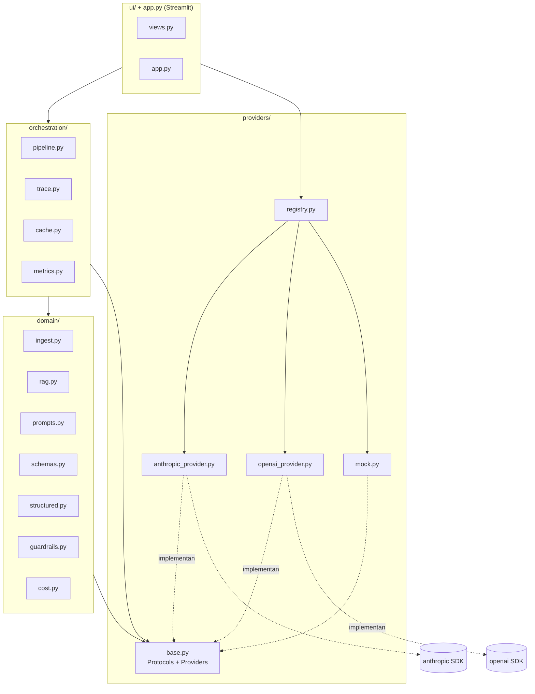
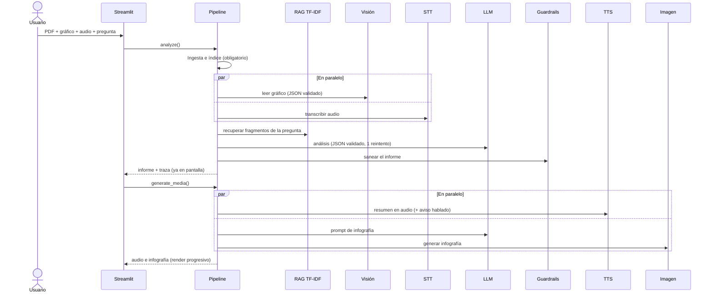

# Arquitectura de FinLens

Documento técnico complementario al [README](../README.md). Describe cómo se separan las capas, cómo se
orquestan los modelos y qué ocurre cuando algo falla.

## 1. Capas y dependencias

Reglas que **hace cumplir un test** (`tests/test_arquitectura.py`, recorre el código con `ast`):

1. Ningún módulo fuera de `providers/` importa `anthropic` ni `openai`.
2. `domain/` y `orchestration/` solo importan de `providers/` el módulo `base` (los *Protocols*), y nunca
   importan `streamlit` ni `ui/`.

Consecuencia práctica: cambiar de proveedor (p. ej. otro LLM) es escribir una clase que cumpla un *Protocol* y
registrarla en `registry.py`; no se toca ni el dominio ni el orquestador.

## 2. Contratos (`providers/base.py`)

| Protocol | Método | Devuelve |
|---|---|---|
| `LLMProvider` | `complete(system, messages, max_tokens)` | `TextResult` (texto, modelo, tokens) |
| `VisionProvider` | `describe_image(image, mime, prompt)` | `TextResult` |
| `STTProvider` | `transcribe(audio, filename)` | `TranscriptionResult` (texto, duración) |
| `TTSProvider` | `synthesize(text)` | `SpeechResult` (audio, mime, caracteres) |
| `ImageProvider` | `generate(prompt)` | `ImageResult` (imagen, mime) |

`Providers` agrupa los cinco y es lo único que recibe el orquestador. Los fallos de red, cuota o clave se
traducen a `ProviderError` con un mensaje en español (sin datos sensibles); el orquestador no conoce las
excepciones de ningún SDK.

## 3. Secuencia de un análisis

Cada paso añade un `TraceStep` (paso, modelo, segundos, nota, coste estimado, tokens o cantidad facturable,
estado, si fue en paralelo). La pestaña **Traza de modelos** y `scripts/medir.py` leen esos mismos registros.

## 4. Degradación elegante

| Si falla… | Qué ocurre |
|---|---|
| Ingesta del PDF (vacío, dañado, cifrado, sin texto) | Se detiene con un mensaje claro y se muestra la traza hasta el fallo |
| Análisis del LLM (clave inválida, JSON inválido tras reintento…) | Se detiene con un mensaje claro y la traza |
| Lectura del gráfico (imagen corrupta, error del proveedor) | Informe sin gráfico + aviso |
| Transcripción (audio vacío, sin voz, error) | Informe sin audio + aviso; si el audio era la pregunta se usa la de defecto |
| TTS | Se entrega el informe y la infografía + aviso |
| Imagen o su prompt | Se entrega el informe y el audio + aviso |
| El guardrail detecta una recomendación | Se retira el fragmento, se avisa y el informe se entrega |
| Excepción inesperada en un paso opcional | Se degrada igual; el aviso muestra solo el tipo de error, no su mensaje interno |

## 5. Salidas estructuradas

Toda salida del LLM se pide como JSON de un esquema Pydantic (`domain/schemas.py`) y se valida
(`domain/structured.py`):

- El *system prompt* incluye el esquema; si la respuesta no es JSON válido o no cumple el esquema, se
  **reintenta una vez** devolviendo al modelo el motivo del fallo; si vuelve a fallar se lanza
  `StructuredOutputError` con un mensaje apto para la UI.
- `Finding` y `KeyFigure` **exigen al menos una `Citation`** (`documento p.3`, `grafico`, `audio`). Una
  respuesta de chat sin base en los materiales debe declararlo (`grounded=false`) en lugar de inventar citas.
- La visión usa el mismo mecanismo (`ask_structured_vision`).

## 6. Compliance por diseño

`domain/guardrails.py` aplica expresiones regulares (sin acentos ni mayúsculas) para detectar verbos de
recomendación seguidos de una acción (`recomiendo comprar`), imperativos (`compra ya`), términos de
valoración (`precio objetivo`, `rating: sobreponderar`) y jerga en inglés. Se aplica a:

- el informe completo (resumen, cifras, lectura del gráfico, declaraciones, correlaciones, limitaciones);
- las respuestas del chat;
- el guion del audio (si infringe, **no se genera el audio**);
- el prompt de la infografía (si infringe, **no se genera la imagen**).

Es una heurística conservadora, no exhaustiva: ver la lista de huecos conocidos en el README.

## 7. Estrategia de pruebas

| Tipo | Qué cubre | Coste |
|---|---|---|
| Unitarias con *mocks* | Ingesta, RAG, prompts, esquemas, guardrails, coste, caché, métricas | 0 |
| Proveedores con clientes falsos | Parámetros enviados, extracción de la respuesta, traducción de errores | 0 |
| Integración con clases reales y clientes falsos | El pipeline completo pasa por `Anthropic*` y `OpenAI*` | 0 |
| UI con `streamlit.testing` | Flujo completo, pestañas, chat, caché, casillas, errores | 0 |
| Arquitectura | Reglas de dependencias entre capas | 0 |
| Humo en vivo (`-m live`, opt-in) | Los modelos configurados existen y cada modalidad responde | Céntimos |

## 8. Cómo añadir un proveedor

1. Crear una clase en `providers/` que cumpla el *Protocol* correspondiente y traduzca los errores de su SDK a
   `ProviderError`.
2. Construirla en `registry.build_real_providers` a partir de `Settings`.
3. Añadir sus variables a `config.py` y `.env.example`, y tests con un cliente falso.
